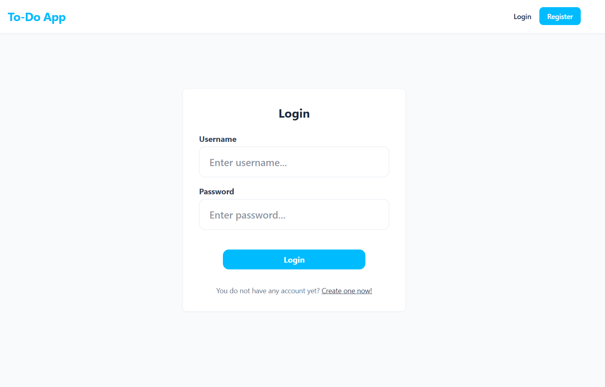
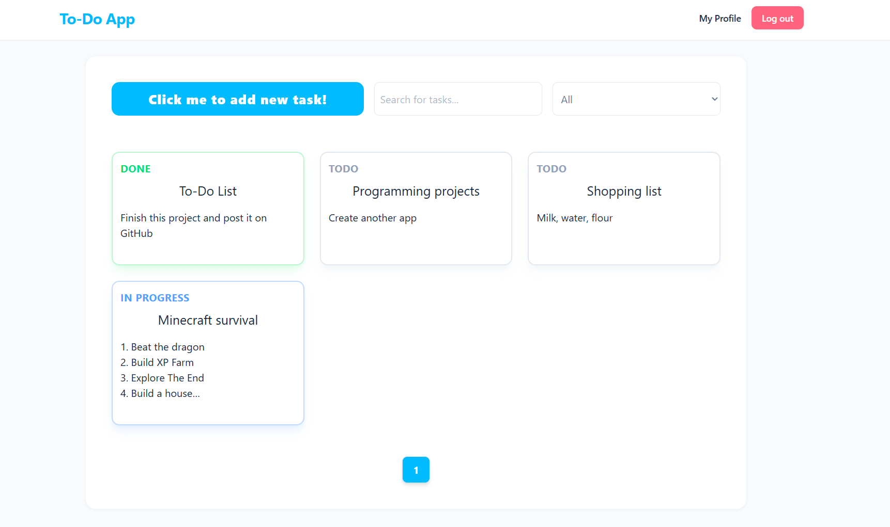
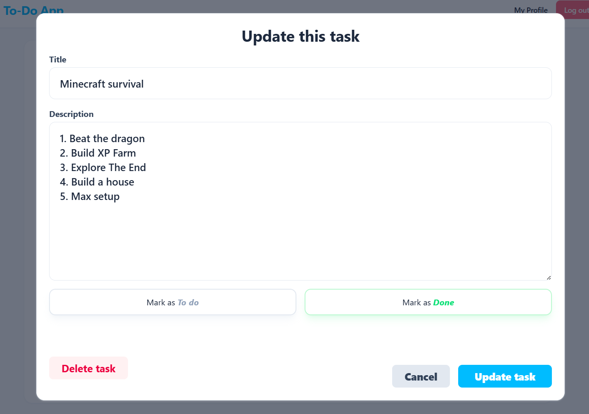
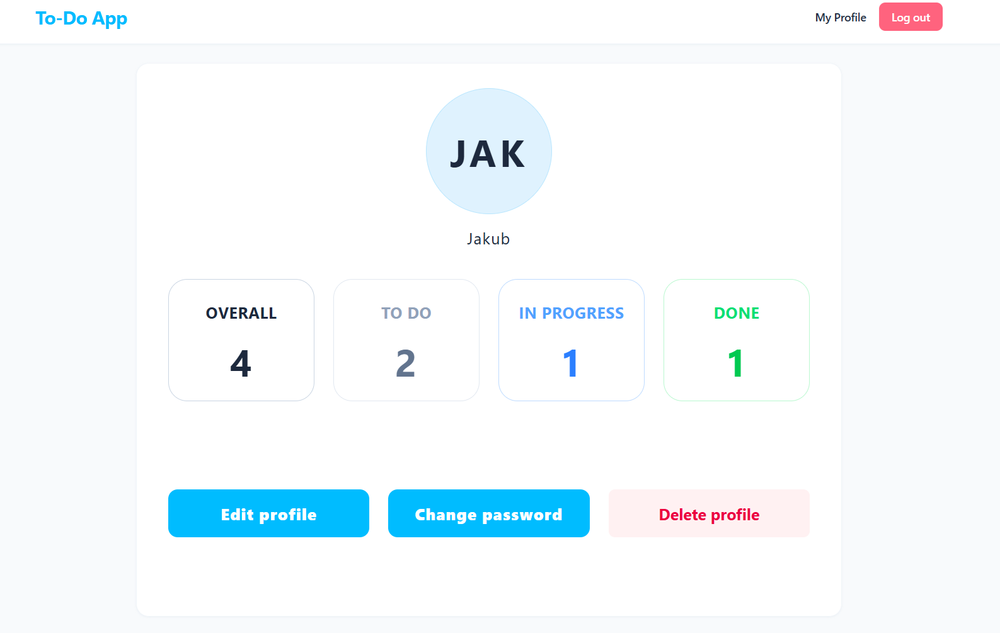

# 📝 Full-Stack Task Management App


A modern, responsive, and secure To-Do application built with a microservices-oriented mindset. It features a robust Spring Boot backend and a dynamic React frontend, all containerized with Docker for a seamless "one-click" deployment.

---

## 📸 Screenshots

| Login Page | Dashboard |
|:---:|:---:|
|  |  |

| Add/Edit Task | Profile Management |
|:---:|:---:|
|  |  |

---

## ✨ Features

- **Robust Authentication:** Stateless JWT authentication stored securely in `HttpOnly` cookies.
- **Task Management:** Full CRUD operations (Create, Read, Update, Delete) for tasks.
- **Smart Dashboard:** 
  - Server-side pagination.
  - "Live" search with debouncing (reduces unnecessary API calls).
  - Status filtering combined with text search.
- **Profile Management:** Update username, change passwords, and completely delete accounts with cascading cleanup.
- **Modern UI/UX:** Built with Tailwind CSS, featuring conditional empty states, controlled components, and smooth transitions.
- **Test-Driven Backend:** Comprehensive unit tests for services using Mockito and JUnit 5.

---

## 🛠️ Tech Stack

### Backend (API)
- **Java 25** with **Spring Boot 4.0.0**
- **Spring Data JPA** & **Hibernate**
- **Spring Security** & **JWT**
- **PostgreSQL** Database
- **JUnit 5** & **Mockito** (Testing)

### Frontend (Client)
- **React 19** & **Vite**
- **TypeScript**
- **Tailwind CSS**
- **Axios** (Configured for credentials/cookies)
- **Zod** & **React Hook Form** (Validation)

### Infrastructure
- **Docker** & **Docker Compose**

---

## 🚀 Getting Started

Running the entire application (Database + Backend + Frontend) requires absolutely zero manual configuration if you have Docker installed.

### Prerequisites
- [Docker Desktop](https://www.docker.com/products/docker-desktop/) installed and running.

### Installation

1. **Clone the repository**
   ```bash
   git clone https://github.com/your-username/nodenotes.git
   cd nodenotes
   ```

2. **Set up environment variables**
   Copy the example environment file and rename it to `.env`:
   ```bash
   cp .env.example .env
   ```
   > **Note:** For local development, you can safely use the default values provided in `.env.example`. However, for production deployment, it is strongly recommended to change the database credentials and generate a secure JWT secret.

3. **Run the stack with Docker Compose**
   ```bash
   docker-compose up -d --build
   ```

4. **Access the application**
   - **Frontend:** Open your browser and go to `http://localhost:5173`
   - **Backend API:** Available at `http://localhost:8080/api`
   - **Swagger UI (API Docs):** Available at `http://localhost:8080/swagger-ui.html`
   - **Database:** PostgreSQL runs on port `5433` locally.

To stop the application, run:
```bash
docker-compose down
```

### 💻 Local Development (Editing Code)
If you intend to modify the frontend code, you must install the Node dependencies locally so your IDE (like VS Code or IntelliJ) can resolve TypeScript types and ESLint rules, otherwise you will see red errors.

1. Navigate to the frontend directory:
   ```bash
   cd frontend-react
   ```
2. Install dependencies:
   ```bash
   npm install
   ```

---